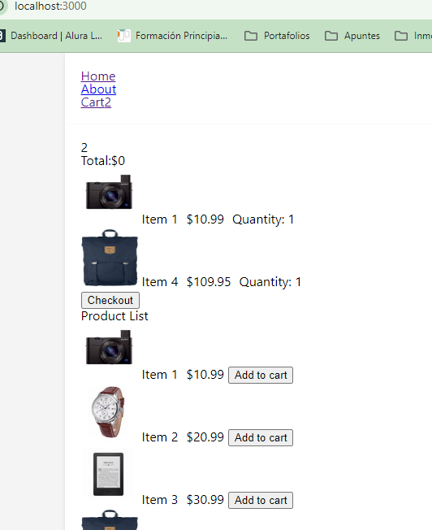
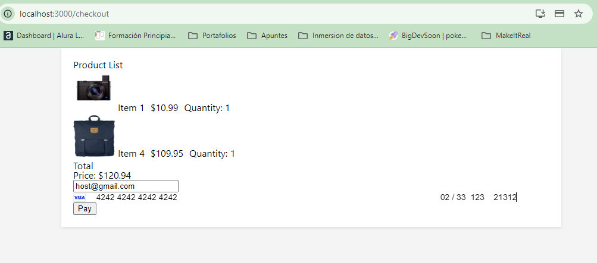
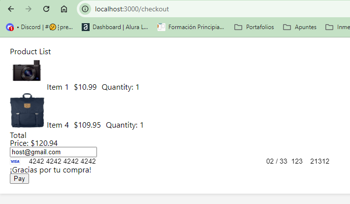
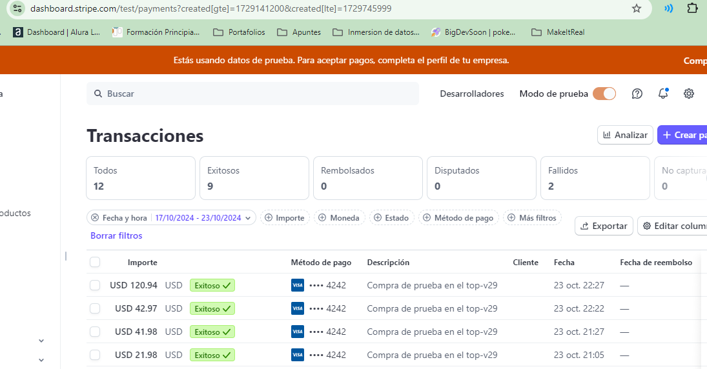

# Proyecto de Pagos con Stripe - Frontend

Este es el frontend de un proyecto de pagos utilizando Stripe, desarrollado con React y estilizado con SCSS.

## Tabla de Contenidos

- [Resumen](#resumen)
- [El desafío](#el-desafío)
- [Pantallazo](#pantallazo)
- [Mi proceso](#mi-proceso)
- [Tecnología utilizada](#tecnología-utilizada)
- [Lo que aprendí](#lo-que-aprendí)
- [Desarrollo a futuro](#desarrollo-a-futuro)
- [Recursos útiles](#recursos-útiles)
- [Autor](#autor)
- [Agradecimientos](#agradecimientos)

## Resumen

Para ejecutar este proyecto, sigue los siguientes pasos:

1. Clona el repositorio en tu máquina local.
2. Navega al directorio del proyecto.
3. Instala las dependencias ejecutando:
   ```bash
   npm install
   npm start
   ```

### El desafío

Los usuarios deben ser capaces de:

- Ver una lista de productos.
- Agregar productos a un carrito.
- Realizar un pago seguro utilizando Stripe.
- Visualizar un resumen del pedido con el total.

### Pantallazo

Se ve la pagina principal, donde uno escoge 2 productos y da al boton "checkout"


En la pagina checkout, uno ve el precio total, tiene que colocar a la tarjeta "4242 4242 4242 4242" para que acepte como una tarjeta valida Stripe, se coloca fecha cvc y codigo postal... y luego boton en "pay"... de colocar algun otro numero de tarjeta le dira que la tarjeta está rechazada.


De realizarse con exito la operacion dira "gracias por tu compra"


En el dashboard de Stripe aparecerá esta simulación de compra.


## Mi proceso

- Se utilizó React para construir la interfaz de usuario.
- Se implementó Stripe para gestionar los pagos.
- Se utilizó SCSS para los estilos, permitiendo una organización más eficiente de los mismos.

### Tecnología utilizada

- **React**: Para la construcción de la interfaz.
- **Stripe**: Para el procesamiento de pagos.
- **SCSS**: Para los estilos.
- **Zod**: Para la validación de datos.

### Lo que aprendí

Durante el desarrollo de este proyecto, aprendí a integrar Stripe en una aplicación de React, gestionar el estado de la aplicación con contexto y validar formularios utilizando Zod. A continuación, algunos fragmentos de código destacados:

```javascript
import { loadStripe } from "@stripe/stripe-js";
const stripePromise = loadStripe("tu_clave_publica_de_stripe");
```

### Desarrollo a futuro

En futuros proyectos, planeo explorar más sobre la optimización de aplicaciones de React y la implementación de pruebas automatizadas. También me gustaría mejorar la accesibilidad y la experiencia del usuario.

### Recursos útiles

Documentación de Stripe
Guía de SCSS
Zod Documentation

## Autor

- Github - [@Mikelyto1994](https://github.com/Mikelyto1994)

## Agradecimientos

Agradezco a los instructores del curso Make It Real por proporcionar un marco tan útil para este proyecto. Me basé en el ejercicio ya avanzado por el profesor khriztianmoreno
